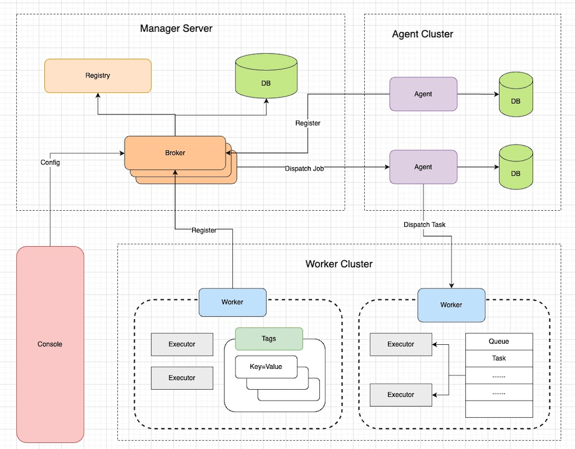

# 简介

**flowjob**主要用于搭建统一的任务调度平台，方便各个业务方进行接入使用。 项目在设计的时候，考虑了扩展性、稳定性、伸缩性等相关问题，可以作为公司的任务调度中间件被使用。

## 在线试用

[在线试用](http://flowjob.tzgo.top)

账号：flowjob

密码：fjdemo

## 功能介绍

**flowjob**主要分为以下几个部分：

* Broker：管控节点，对配置好的任务在集群进行负载，调度任务并下发Agent，同时管理和维护Agent/Worker节点注册等。
* Agent：代理节点，接收下发的Job信息，生成Task下发给Worker执行，处理Job的生命周期，比如工作流流转等。
同时此节点可以减少广播/Map/MapReduce等分片任务导致Broker存在的数据/性能压力，以及云原生环境下一些启停导致的数据问题。
* Worker：工作节点，主要负责Task的具体执行。
* Console：通过Broker提供的Api，进行任务创建/更新等一些管控操作。
* Registry：注册中心，目前使用DB做为注册中心。提供了对应接口，可以基于其它组件如zk、nacos等进行灵活的封装。
* Datasource：数据库用于持久化运行数据

<div align="center">

</div>

### 调度类型

* 固定速度：作业创建后，每次调度下发后，间隔固定时间长度后，再次触发作业调度。
* 固定延迟：作业创建后，每次作业下发执行完成（成功或失败）后，间隔固定时间长度后，再次触发作业调度。
* CRON：通过CRON表达式指定作业触发调度的时间点。

### 负载策略

* 随机：将作业随机下发给某一个worker执行。
* 轮询：将任务逐个分配给worker。
* 最不经常使用：将作业下发给一个时间窗口内，接收作业最少的worker。
* 最近最少使用：将作业下发给一个时间窗口内，最长时间没有接受worker的worker。
* 一致性hash：同样参数的作业将始终下发给同一台机器。
* 指定节点：让作业指定下发到某个worker执行。

### 节点过滤方式

1. 执行器：任务只会下发给包含任务对应执行器的worker。
2. 标签：任务只会下发给包含指定标签的worker。
3. 容量：基于worker的任务队列/CPU/内存使用情况过滤

### 任务触发方式

* API：通过指定api触发任务执行。
* 调度：Broker自动组装数据，调度对应的任务。

### 任务类型

按大体配置分为：
* 普通任务：只会执行一个Job。
* 工作流任务：DAG视图，可以串联Job


按Job类型分为：
* 普通：对应某个执行器，执行结束任务结束。
* 广播：在下发的时间点，对每个可下发的节点下发任务，所以子任务执行完成当前任务才执行完成。
* Map：分为sharding和map两个步骤。sharding的时候进行分片，map则对每个拆分任务进行执行。
* MapReduce：相比于Map多了Reduce过程，可以对所有Map任务的执行结果进行一个汇总。

# 使用帮助

## Server部署

### 环境要求

- JDK8
- Mysql

### Step1: 数据库配置

目前使用`flywaydb`动态地进行数据初始化操作

| 配置项                | 说明   |
|--------------------|------|
| spring.datasource.url | 连接地址 |
| spring.datasource.username | 账号   |
| spring.datasource.password | 密码   |

### Step2: 服务打包

根据需要修改配置

| 配置项                                     | 说明                                                                                   |
|-----------------------------------------|--------------------------------------------------------------------------------------|
| flowjob.broker.name                     | 节点名称，保持全局唯一。默认不配置自动生成即可 |
| flowjob.broker.host                     | 提供给worker的服务的 host。可以是域名或 IP 地址，如不填写则自动发现本机非 127.0.0.1 的地址。多网卡场景下，建议显式配置 host。       |
| flowjob.broker.port                     | 提供给worker的服务 port 如果未指定此配置，则尝试使用 ${server.port} 配置；如 ${server.port} 配置也不存在，则使用 8080， |
| flowjob.broker.scheme                   | RPC 通信协议类型。默认为 http。于worker保持一致                                                      |
| flowjob.broker.heartbeat-interval       | broker心跳时间间隔，毫秒。默认2000                                                               |
| flowjob.broker.heartbeat-timeout        | broker心跳超时时间，毫秒。默认5000                                                               |
| flowjob.broker.worker.heartbeat-timeout | worker心跳超时时间，毫秒。默认5000                                                               |

项目根目录下，执行如下命令打包编译，通过`-P`参数指定环境，如开发环境为`-P dev`

```
mvn clean package -Dmaven.test.skip=true -Pdev
```

## Worker部署

对于需要使用worker的Web应用（宿主应用），可以参考[Demo](https://github.com/limbo-world/flowjob/tree/master/worker-spring-boot-demo)。


### Step1: 添加依赖

对于`Maven`项目

```
<dependency>
    <groupId>io.github.limbo-world</groupId>
    <artifactId>flowjob-worker-spring-boot-starter</artifactId>
    <version>2.0.0</version>
</dependency>
```

### Step2: 修改配置

| 配置项                      | 说明                                                                          |
|--------------------------|-----------------------------------------------------------------------------|
| flowjob.worker.name      | 节点名称，保持全局唯一。默认不配置自动生成即可                                                     |
| flowjob.worker.scheme    | RPC 通信协议类型。默认为 http。于broker保持一致                                             |
| flowjob.worker.host      | RPC host。可以是域名或 IP 地址，如不填写则自动发现本机非 127.0.0.1 的地址。多网卡场景下，建议显式配置 host。        |
| flowjob.worker.port      | RPC port 如果未指定此配置，则尝试使用 ${server.port} 配置；如 ${server.port} 配置也不存在，则使用 8080， |
| flowjob.worker.brokers   | Broker节点地址，可配置多个，参考DEMO中的配置                                                 |
| flowjob.worker.heartbeat | Worker 向 Broker 发送心跳请求的间隔，默认 2 秒。                                           |
| flowjob.worker.tags      | 标签，k=v形式                                                                    |

# 前端应用

结合Api开发了相应的前端页面：[点击跳转](https://github.com/limbo-world/flowjob-console)

# 参与贡献

如果你对本项目有任何建议或想加入我们的，可以通过下面方式：，欢迎提交 issues 进行指正。

- 报告 issue: [github issues](https://github.com/limbo-world/flowjob/issues)
- 提交PR：[github PR](https://github.com/limbo-world/flowjob/pulls)
- 加入我们：ysodevilo@163.com
